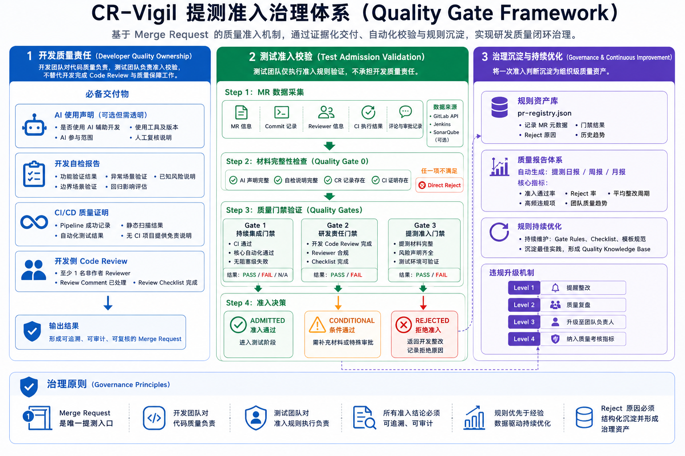

# CR-Vigil Monitor

CR-Vigil 是一个面向 AI 辅助代码提测的质量门禁工具。它从 GitLab MR 或本地 Markdown 文件采集数据，按四道门禁评估是否准入测试，并生成单 MR 提测报告、日报和周报。

核心原则：

- 测试人员只需要使用 Skill 命令。
- Claude Code、Codex、通用 Agent、CI 和手动执行统一走 `python -m crvigil`。
- Python 负责确定性采集、评估、渲染和存储，Skill 负责入口编排和中文摘要。



## 最简使用

第一次使用先设置 GitLab Token：

```bash
export GITLAB_TOKEN="你的 GitLab Token"
```

判断一个 MR 能不能提测：

```bash
/cr-vigil-monitor --admit <MR链接>
```

生成日报和周报：

```bash
/cr-vigil-monitor --digest
/cr-vigil-monitor --trend
```

本地文件测试：

```bash
/cr-vigil-monitor --admit-file .claude/skills/cr-vigil-monitor/assets/sample-pr.md
```

报告输出位置：

```text
reports/admissions/   单个 MR 提测报告
reports/digests/      日报
reports/trends/       周报
```

## Python 统一入口

所有 Agent、CI 和手动执行都应调用统一 Python 后端：

```bash
python -m crvigil admit <MR链接>
python -m crvigil admit-file <文件路径>
python -m crvigil declare <MR链接>
python -m crvigil digest
python -m crvigil trend
python -m crvigil validate
```

本地实验或避免 Git 同步时：

```bash
python -m crvigil --no-sync admit <MR链接>
python -m crvigil --no-sync admit-file <文件路径>
python -m crvigil --no-sync digest
python -m crvigil --no-sync trend
```

也可以安装成本地命令：

```bash
pip install -e .
crvigil validate
crvigil admit <MR链接>
```

## 运行流程

CR-Vigil 按阶段推进，前一阶段未完成时不会生成报告。

| 阶段 | 作用 | 产物 |
|------|------|------|
| 阶段 0 | JSON 自检与修复 | registry 校验摘要 |
| 阶段 1 | 采集数据并完成四道门禁评估 | gates、verdict、blocking_reasons |
| 阶段 1.5 | 写入摘要快照 | data/snapshots/ |
| 阶段 2 | 生成 Markdown 报告 | reports/ |
| 阶段 3 | 团队模式下同步结果 | Git pull/push 状态 |

`admit` 流程：

```text
sync pull
→ validate registry
→ collect MR data
→ evaluate gates
→ write mrs/events/snapshots
→ render admission report
→ sync push
→ 中文摘要
```

`digest` 和 `trend` 会读取活跃 MR 索引，自动 hydrate `data/mrs/` 中的完整 MR 状态后生成报告。

## 数据存储

当前是正式分层存储模式：

```text
data/pr-registry.json          轻量索引，storage_mode=index
data/mrs/<PR_ID>.json          单个 MR 完整当前状态
data/events/YYYY-MM.jsonl      采集、评估、报告生成事件日志
data/snapshots/*.json          日报/周报摘要快照
reports/                       Markdown 报告
```

说明：

- `data/pr-registry.json` 只保存摘要和 `record_path`。
- 完整 MR 当前状态读取 `data/mrs/<PR_ID>.json`。
- 事件历史追加写入 `data/events/YYYY-MM.jsonl`。
- 快照只保留日报/周报需要的摘要字段，不再复制完整 MR 大对象。
- 报告文件保存在本地，团队模式下会随 Git 同步。

不要手工编辑 `data/pr-registry.json`。需要校验或修复时使用：

```bash
python -m crvigil validate
python -m crvigil validate --repair --write
```

## 判定规则

CR-Vigil 使用四道门禁：

| 门禁 | 核心要求 | 状态 |
|------|----------|------|
| 门禁一：CI 质量红线 | UT 100%、覆盖率 >= 70%、静态扫描无阻断/严重问题、冒烟 100% | PASS / FAIL / N/A |
| 门禁二：AI 声明 + 人工 CR | AI 声明、非作者资深审查人、实质性评论、12 项 Checklist | PASS / WARN / FAIL |
| 门禁三：测试准入声明 | CI 证明、CR 批准链接、自检声明 | PASS / FAIL / N/A |
| 门禁四：故障追溯 | 事后追溯记录，不阻断提测 | READY / N/A |

准入判定：

```text
全部有效门禁 PASS                 -> ADMITTED
Gate2 WARN 且其他有效门禁 PASS    -> CONDITIONAL
任一有效门禁 FAIL                 -> REJECTED
任一有效门禁 PENDING              -> PENDING
Gate1=N/A                         -> 不阻断提测
```

详细规则见：

```text
.claude/skills/cr-vigil-monitor/references/gate-rules.md
.claude/skills/cr-vigil-monitor/references/checklist-12-items.md
.claude/skills/cr-vigil-monitor/references/data-schema.md
.claude/skills/cr-vigil-monitor/references/gitlab-field-mapping.md
```

## 开发提测材料

开发需要在 MR 描述或评论中提供以下材料。缺失材料会导致 `REJECTED`。

```markdown
## AI 辅助声明
- [ ] 本 MR 未使用 AI 辅助
- [ ] 本 MR 使用了 AI 辅助，AI 生成代码占比约：__%
  - 使用工具：
  - AI 生成的主要模块：

## 开发自检声明
- [ ] 本次提测代码已通过 CI 全部质量门禁
- [ ] 所有 AI 辅助代码已完成开发 CR，Checklist 全部勾选
- [ ] 已对 AI 生成的边界条件和异常逻辑进行人工验证
- [ ] 本人已在本地完成基础功能自测，主流程可正常运行
- [ ] 无已知的阻断性缺陷被刻意隐瞒

开发签名：
日期：

## 开发 CR 信息
- Reviewer：
- CR 批准链接：
- 实质性评论链接：
```

说明：

- Reviewer 应为非作者的资深开发工程师。
- 测试负责运行 CR-Vigil 做准入校验，不承担代码 CR 责任。
- 项目无 CI 时，门禁一可自动标记为 N/A；门禁二和门禁三仍需满足。

开发也可以使用 `declare` 命令一键生成预填好的声明模板：

```bash
python -m crvigil declare <MR链接>
```

命令会自动从 GitLab 采集 CI 状态、审查人、AI 声明等数据，生成可直接粘贴到 MR 描述中的声明 Markdown。

## 配置

报告和存储策略通过 `cr-vigil.yml` 配置。

```yaml
storage:
  history_limit_per_mr: 50
  daily_snapshot_retention_days: 30
  weekly_snapshot_retention_weeks: 12

sync:
  push_retry: 1

reports:
  admission:
    profile: detailed
  daily:
    profile: standard
    sections:
      pending_prs: false
      detailed_gate_reasons: false
      action_items: true
  weekly:
    profile: standard
    sections:
      reviewer_stats: true
      recurrence: true
      recommendations: true
```

## 团队模式与个人模式

默认是团队共享模式，会自动执行 Git pull/push：

```bash
/cr-vigil-monitor --admit <MR链接>
```

个人实验可跳过同步：

```bash
export CRVIGIL_MODE=personal
python -m crvigil --no-sync admit <MR链接>
```

同步状态会出现在 JSON 输出的 `sync_status` 字段中：

```text
synced    已同步
skipped   已跳过同步
failed    同步失败，但本地报告可能已经生成
```

## 环境变量

```bash
export GITLAB_TOKEN="glpat-xxxx"
export CRVIGIL_MODE=personal
export CRVIGIL_CA_FILE="/etc/ssl/cert.pem"
export CRVIGIL_SSL_VERIFY=false
```

仅本地实验且明确接受风险时，才使用 `CRVIGIL_SSL_VERIFY=false`。

CI Job 名称不标准时可配置映射：

```bash
export CRVIGIL_JOB_MAPPING='{
  "unit_test": "run-unit-tests",
  "coverage": "coverage-report",
  "static_scan": "sonarqube-scan",
  "smoke_test": "smoke-tests"
}'
```

## Agent 和 CI 接入

```text
AGENTS.md              Agent 通用规则
docs/agent-contract.md 通用 JSON 契约
docs/codex-usage.md    Codex 使用说明
docs/ci-usage.md       CI/定时任务说明
docs/flowchart.md      Mermaid 流程图
```

关键约定：

- stdout 输出机器可读 JSON。
- stderr 仅用于执行异常。
- `REJECTED` 是业务判定，不是程序错误。
- 只有认证失败、GitLab API 失败、JSON 修复失败、报告生成失败等执行异常才返回非 0。

## 定时生成

每日生成日报：

```text
/loop 24h /cr-vigil-monitor --digest
```

每周生成周报：

```text
/loop 7d /cr-vigil-monitor --trend
```

CI 或定时任务建议使用：

```bash
python -m crvigil --no-sync digest
python -m crvigil --no-sync trend
```

## 项目结构

```text
CR-Vigil/
├── README.md
├── CHANGELOG.md
├── AGENTS.md
├── cr-vigil.yml
├── pyproject.toml
├── crvigil/
│   ├── cli.py              # python -m crvigil 入口
│   ├── workflow.py         # 阶段驱动工作流
│   ├── declaration.py      # 声明模板生成
│   ├── gitlab_collect.py   # GitLab MR 采集
│   ├── file_collect.py     # Markdown 文件采集
│   ├── evaluator.py        # 门禁评估
│   ├── renderer/           # 报告渲染
│   ├── storage.py          # registry index + mrs hydrate
│   ├── events.py           # JSONL 事件日志
│   ├── snapshots.py        # 摘要快照
│   └── json_tools.py       # JSON 自检与修复
├── data/
│   ├── pr-registry.json
│   ├── mrs/
│   ├── events/
│   ├── snapshots/
│   └── reviewer-levels.json
├── reports/
│   ├── admissions/
│   ├── digests/
│   └── trends/
├── docs/
│   ├── agent-contract.md
│   ├── ci-usage.md
│   ├── codex-usage.md
│   └── flowchart.md
├── scripts/                # legacy Bash 兼容层
└── .claude/skills/cr-vigil-monitor/
    ├── SKILL.md
    ├── assets/
    ├── references/
    └── scripts/            # legacy wrapper
```

## 维护检查

```bash
python -m unittest discover -s tests
python -m crvigil validate
python -m json.tool data/pr-registry.json
bash -n scripts/*.sh
git diff --check
```
