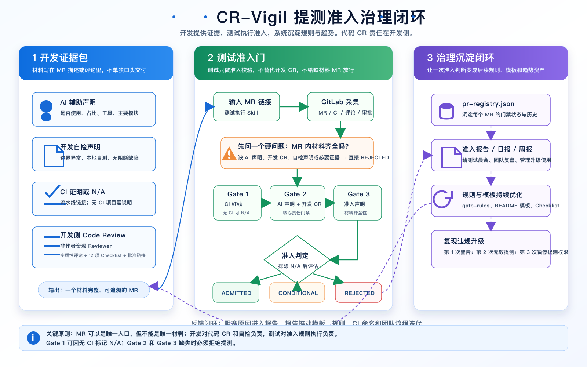
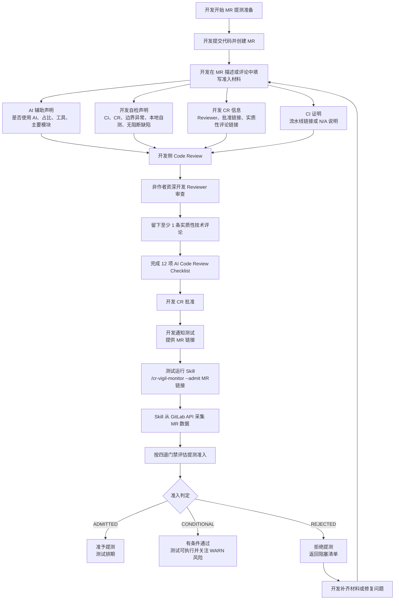
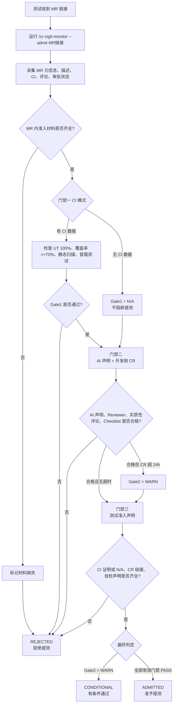
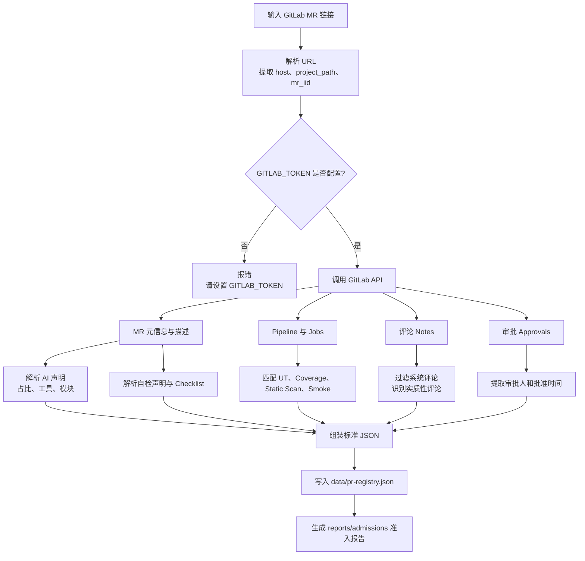
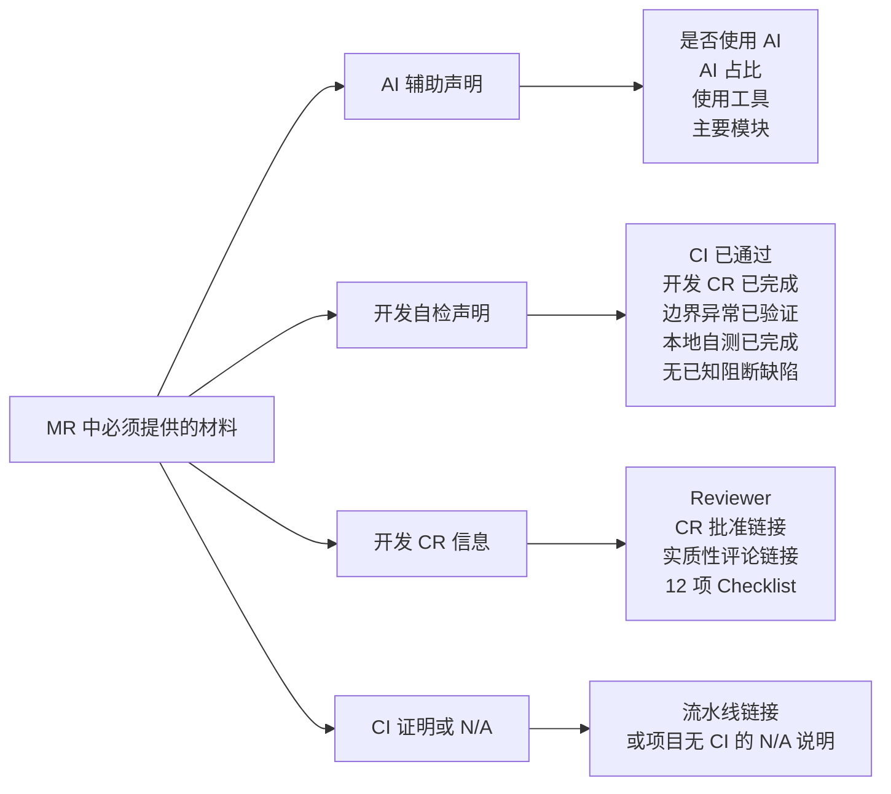
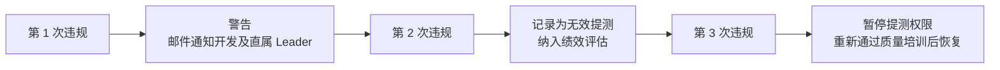
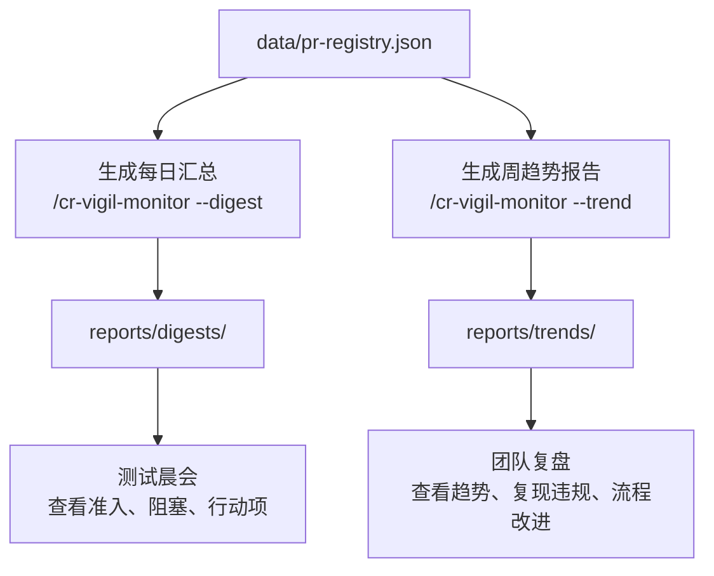

# CR-Vigil Monitor 工作流与流程图

本文档描述当前最新提测准入流程。核心责任边界：

- 开发负责在 MR 描述或评论中提供准入材料，包括 AI 辅助声明、开发自检声明、开发 CR 信息、CI 证明。
- 开发 CR 指开发侧 Code Review，Reviewer 应为非作者的资深开发工程师。
- 测试负责运行 `cr-vigil-monitor` Skill 做提测准入校验，不承担代码 CR 责任。
- 测试执行 Skill 时只需要 MR 链接；如果 MR 内材料缺失，准入判定为 `REJECTED`。

## 信息图版

## 一、角色协作主流程

## 二、测试执行 Skill 的判断流程

## 三、GitLab API 数据采集流程

## 四、开发提测材料最小模板

## 五、违规升级机制

## 六、日报与周报流程

*流程图使用 Mermaid 语法，在支持 Mermaid 的 Markdown 渲染器中可直接显示为图形。*
